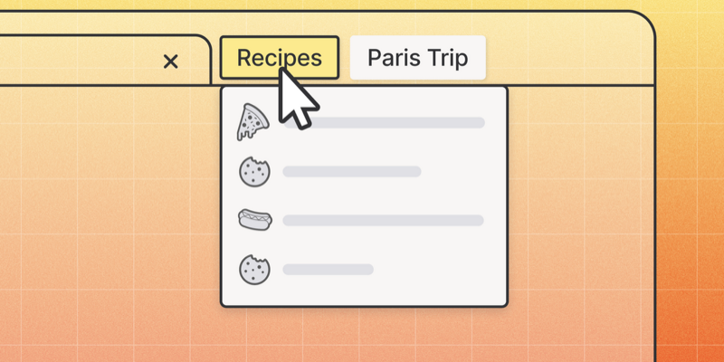
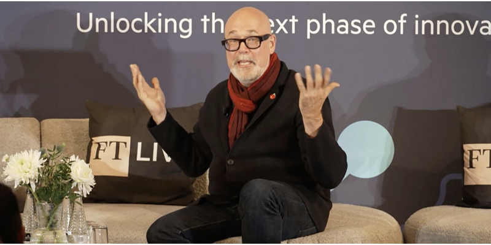
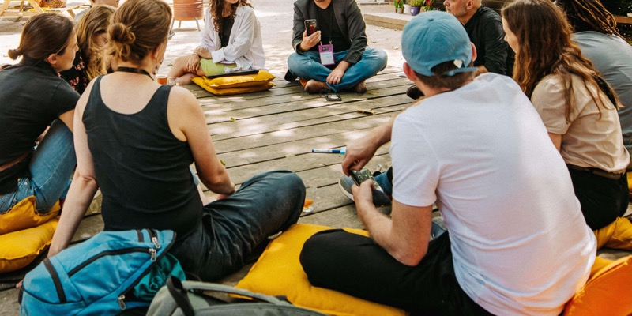
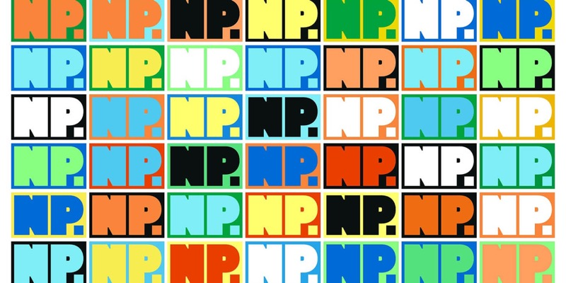

# Writing Alt Text (for Wagtail Editors)

The "alt text" (alternative text) on an image describes images for people who can't see them. Usually this means people who are having the webpage read aloud to them by a device or app.

## When to Use Alt Text

If the image is removed and no context is missing, then the image is decorative and doesn't need alt text. You can leave the field in Wagtail blank.

## Writing Effective Alt Text

- Be concise
- Be specific
- When there are people in it:
    - If you know their names, use their names
    - Do not mention gender, age, or race
    - Describe the action or mood conveyed

### Be Concise

Aim for under 125 characters when possible. Screen readers announce "image" or "graphic" before reading alt text, so don't start with "image of" or "picture of."

✅ `Red panda sleeping on a tree branch` 
❌ `Photo of a red panda sleeping` 
❌ `A cute red panda sleeping peacefully on a tree branch in the forest`

### Be Specific

Describe what's actually in the image, focusing on details relevant to the surrounding content.

✅ `Mozilla VPN dashboard showing connection status` 
❌ `VPN screenshot`

### When there are people in it

- If you know their names, use their names
- Do not mention gender, age, or race
- Describe the action or mood conveyed

✅ `Person with a laptop bag and Mozilla lanyard.` 
✅ `Contributor at a Mozilla hack-a-thon.` 
❌ `Asian woman with her hair in a pony tail.`

## Examples

{ width="400" }    

✅ `A tab group of recipes.` 
✅ `Tab groups appear next to your open tabs.` 
❌ `Screenshot of Firefox`

{ width="400" }    

✅ `Mark Surman, Mozilla President.` 
❌ `Bald white man in a black jacket and red scarf.`

{ width="400" }    

✅ `People sitting in a circle on the floor sharing ideas.` 
❌ `Nine people sitting on yellow pillows on the floor.`

{ width="400" }    

✅ `Nothing Personal logo.` 
✅  If the magazine's name is near-by, blank alt text might be the right thing to do with this image 
❌ `NP. NP. NP. NP. NP. NP. NP. NP. NP.` 
❌ `NP repeated 42 times in different colors.`

## Additional Resources

- [W3C Alt Text Decision Tree](https://www.w3.org/WAI/tutorials/images/decision-tree/)
- [WebAIM Alternative Text](https://webaim.org/techniques/alttext/)
